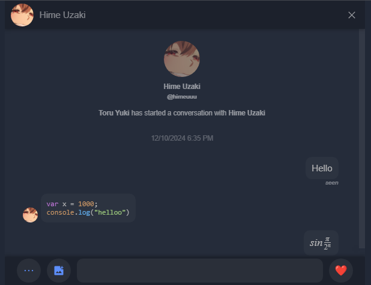
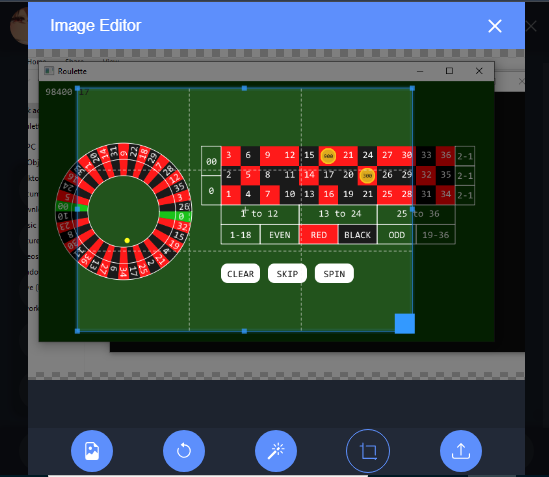

## Hellocat
**A Vanilla JS + Firebase Chat!**

---

### Demo
Here is a [demo](https://hellocat-0.web.app/)!

### Preview




### Overview  
**Hellocat** is a lightweight, real-time chat application built with vanilla JavaScript and Firebase. It allows users to chat instantly with easy-to-use features like media sharing and smooth UI interactions.

---

### Project Setup  
1. Clone the repository from GitHub:  
   ```bash
   git clone https://github.com/2dprototype/Hellocat.git
   cd Hellocat
   ```

2. Add your `Firebase configuration` in the project.  

3. Launch the app using a dev server:
   ```bash
   cd dev
   npm install
   node server.js
   ```
   Access the app at `http://localhost:5600`.

---

### Firebase Hosting Setup

1. Setup a Firebase Project *(Authentication[Email/Password], Hosting, Firestore, Realtime DB, Storage)*.

2. Grab the `firebase config` and set it to [main.js](src/js/main.js)

3. Setup firebase to your project in the root dir using `firebase init` command.

4. Then modify the `firebase.json` like this,

```json
{
    "hosting": {
        "ignore": [
            "firebase.json",
            "**/.*",
            "**/node_modules/**"
		],
		"cleanUrls": true,
		"site": "hellocat",
		"public": "src",
        "rewrites": [
            {
                "destination": "/index.html",
                "source": "**"
			},
			{
				"source": "!/@(js|css|lib|fonts|res)/**",
				"destination": "/index.html"
			} 
		]
	}
}
```


### Libraries Used  
Special thanks to the authors of the following open-source libraries:  
- [jQuery](https://jquery.com/)  
- [Chart.js](https://www.chartjs.org/)  
- [Three.js](https://threejs.org/)  
- [CryptoJS](https://crypto-js.googlecode.com/)  
- [KaTeX](https://katex.org/)  
- [Clipboard.js](https://clipboardjs.com/)  

---

### License  
This project is licensed under the [MIT License](https://opensource.org/licenses/MIT). 